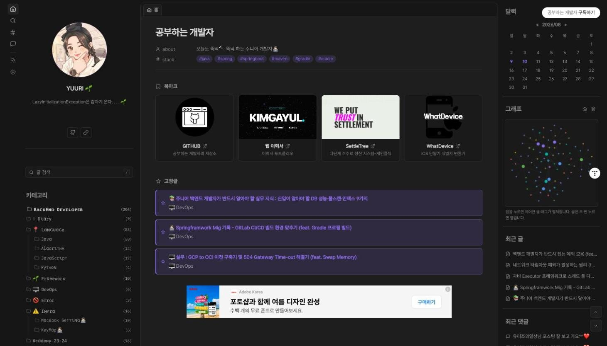
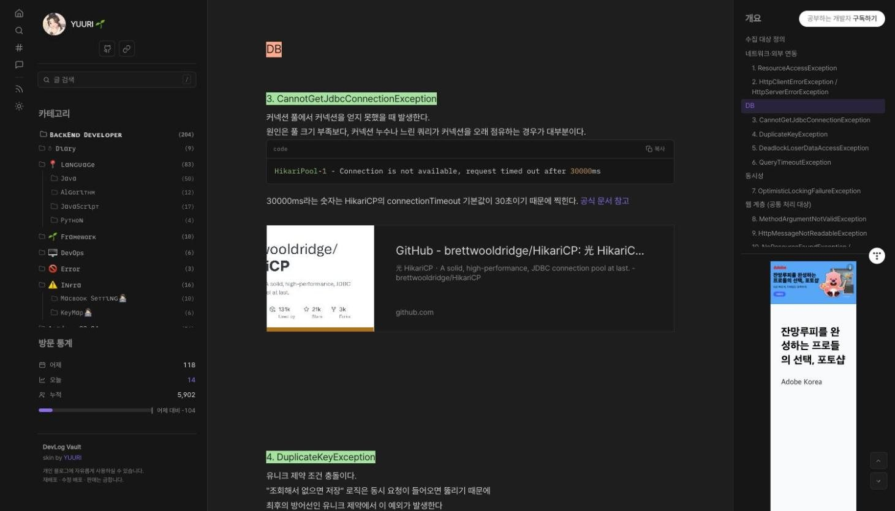
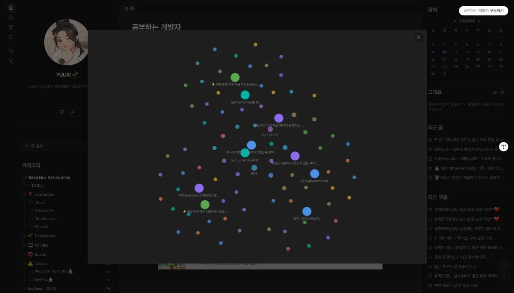
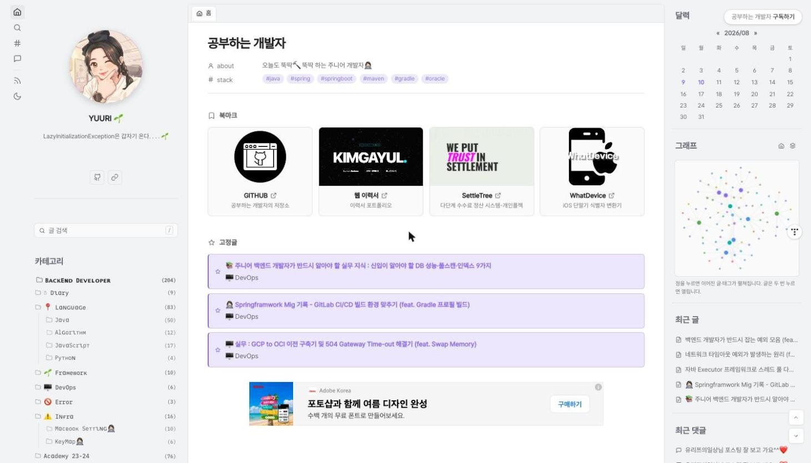
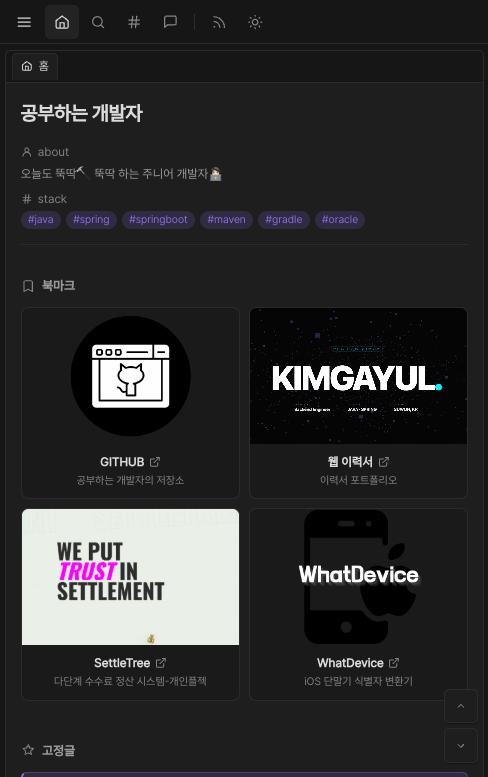
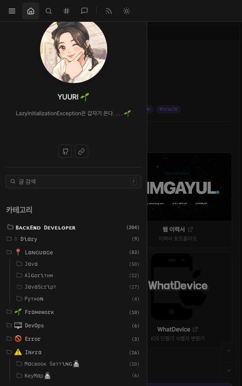

<div align="center">

# DevLog Vault

옵시디언(Obsidian)처럼 생긴 티스토리 스킨입니다.

왼쪽은 파일 탐색기 같은 카테고리, 가운데는 글, 오른쪽은 달력과 개요.
개발 블로그 쓰다가 "옵시디언에서 글 쓰던 그 화면이었으면" 싶어서 만들었습니다.


<a href="https://github.com/gayulz/DevLog_Vault/stargazers"></a>



<table align="center">
<tr><td align="center" width="620">

&nbsp;

🌱 &nbsp; **0원입니다.** 개인 블로그라면 누구든 그냥 가져다 쓰세요

🎨 &nbsp; 색이든 서체든 **내 블로그에 맞게 고쳐 쓰는 것도 자유**예요

🙅 &nbsp; 다만 **재수정 배포 · 재배포 · 유료 판매는 안 됩니다**

⭐ &nbsp; 쓰다가 좋으셨다면 **Star** 하나만요. 그게 다음 버전 만드는 힘이 됩니다

&nbsp;

</td></tr>
</table>

</div>

---

## 목차

- [어떻게 생겼나](#어떻게-생겼나)
- [설치](#설치)
- [화면이 폭에 따라 바뀝니다](#화면이-폭에-따라-바뀝니다)
- [스킨 편집 옵션](#스킨-편집-옵션)
- [글 쓸 때 알아두면 좋은 것](#글-쓸-때-알아두면-좋은-것)
- [광고·분석 코드 넣기](#광고분석-코드-넣기)
- [자주 묻는 것](#자주-묻는-것)
- [라이선스](#라이선스)

---

## 어떻게 생겼나

### 글 읽는 화면



왼쪽 사이드바는 스크롤을 내려도 화면에 붙어 있습니다. 프로필이 접히면서 그 자리를
카테고리가 가져가기 때문에, 글을 한참 내려도 왼쪽이 텅 비지 않아요.
오른쪽 개요는 지금 읽는 위치를 따라옵니다. 코드블록에는 언어 이름과 복사 버튼이 붙습니다.

### 태그 그래프



블로그 RSS를 읽어서 글과 태그가 어떻게 얽혀 있는지 그립니다. 점을 누르면 이어진 것들이
펼쳐지고, 글은 두 번 누르면 열려요. 외부 라이브러리 없이 canvas로만 그립니다.

### 라이트 모드



왼쪽 리본의 달/해 아이콘으로 바꿉니다. 고른 테마는 브라우저가 기억해요.

### 모바일

<table>
<tr>
<td width="50%"></td>
<td width="50%"></td>
</tr>
</table>

리본이 상단 바로 바뀌고, 왼쪽 사이드바는 ☰ 버튼을 누르면 서랍으로 나옵니다.

### 그 밖에

카테고리 트리는 고정폭 서체로 맞춰서 한글까지 세로줄이 딱 떨어집니다. 홈 상단에는 링크
카드를 네 장까지 놓는데, HTML 손댈 필요 없이 스킨 편집에서 설정해요. 고정글은 티스토리
"공지"를 그대로 쓰거나, 글 주소만 넣으면 제목과 카테고리를 알아서 읽어옵니다.

- 표 — 머리글 배경과 줄무늬로 줄 구분, 좁은 화면에서는 가로 스크롤
- 제목 형광펜 — h1 노랑, h2 살구, h3 연두
- 본문 명암비 — WCAG AA 4.5:1 기준
- 외부 JS 라이브러리 없음 — 불러오는 건 서체와 `script.js` 하나뿐

---

## 설치

### 1. 파일 올리기

관리자 → 꾸미기 → 스킨 편집 → html 편집 으로 들어갑니다.

| 탭 | 할 일 |
|---|---|
| HTML | `skin.html` 전체를 붙여넣기 |
| CSS | `style.css` 전체를 붙여넣기 |
| 파일업로드 | `images/script.js` 올리기 |

붙여넣고 적용을 누르면 끝입니다. `index.xml`은 이 방법에서는 쓰지 않아요.

<details>
<summary>zip으로 "스킨 등록"을 하고 싶다면</summary>

관리자 → 꾸미기 → 스킨 변경 → 스킨 등록 에 아래 파일을 묶어서 올립니다.

```
skin.html
style.css
index.xml
images/script.js
preview.gif        (112×84)
preview256.jpg     (256×192)
preview560.jpg     (560×420)
preview1600.jpg    (1600×1200)
```

저장소를 받은 폴더에서 아래를 실행하면 필요한 파일만 담긴 zip이 나옵니다.

```bash
python3 build_release.py
# → dist/DevLog-Vault-v3.8.5.zip
```

다만 이미 쓰고 있는 스킨을 업데이트하는 거라면 이 방법은 피하세요.
`index.xml`이 같이 올라가면서 스킨 편집에 저장해 둔 값(북마크 주소 같은 것)이
초기화될 수 있습니다. 그럴 때는 스킨 편집으로 세 파일만 갈아끼우는 쪽이 안전합니다.

</details>

### 2. 모바일웹 자동 연결 끄기

이걸 안 끄면 휴대폰에서 스킨이 적용되지 않습니다. 티스토리가 기본 모바일 스킨을
대신 보여 주거든요. 설치하고 나서 "왜 폰에서는 그대로지?" 하는 경우가 대부분 이것 때문입니다.

> 관리자 → 꾸미기 → 모바일 → **모바일웹 자동 연결**을 **사용하지 않음**으로

`내블로그주소/m`에 들어갔을 때 이 스킨이 보이면 제대로 꺼진 겁니다.

### 3. 사이드바 위젯 순서 맞추기

관리자 → 꾸미기 → 사이드바 에서 아래 순서로 배치해 주세요.
순서가 다르면 카테고리나 달력이 엉뚱한 자리에 나옵니다.

| 사이드바 1 (왼쪽) | 사이드바 2 (오른쪽) |
|---|---|
| 1. 프로필 | 1. 달력 |
| 2. 검색 | 2. 최근 글 |
| 3. 카테고리 | 3. 인기 글 |
| 4. 방문 통계 | 4. 최근 댓글 |

메뉴바와 구독 버튼은 오른쪽 상단만 피해 주세요. 스킨의 탭 바와 겹칩니다.

---

## 화면이 폭에 따라 바뀝니다

| 폭 | 배치 |
|---|---|
| 1501px~ | 리본 + 왼쪽 사이드바 + 본문 + 오른쪽 사이드바 |
| 1181~1500px | 왼쪽 사이드바를 조금 줄인 4열 |
| 1001~1180px | 오른쪽 사이드바(달력·그래프·개요)를 접은 3열 |
| 761~1000px | 왼쪽 사이드바가 서랍으로 |
| ~760px | 모바일 |

모바일에서는 오른쪽 사이드바 내용(달력·최근 글·인기 글·최근 댓글)이 본문 아래로 내려와
카드로 쌓입니다. 그래프와 개요는 접습니다. 그래프는 손가락 드래그가 페이지 스크롤과
겹치고, 개요는 이미 지나온 글을 다시 가리키니까요. 아이폰 노치와 홈 인디케이터
영역도 피해서 여백을 잡습니다.

---

## 스킨 편집 옵션

관리자 → 꾸미기 → 스킨 편집 오른쪽 패널에서 설정합니다. HTML을 고칠 일은 없습니다.

### 디자인

| 옵션 | 형식 | 기본값 | 설명 |
|---|---|---|---|
| 강조 색상 | 색 | `#8b6cef` | 링크, 태그, 현재 페이지 같은 포인트 색 |
| 본문 배경 (다크) | 색 | `#1e1e1e` | 다크 모드 글 영역 배경 |
| 사이드바 배경 (다크) | 색 | `#161616` | 다크 모드 좌우 사이드바 배경 |

라이트 모드 색은 스킨이 알아서 맞춥니다. 비워 두면 기본값이 그대로 쓰여요.

### 홈 — 소개, 기술 스택

| 옵션 | 형식 | 설명 |
|---|---|---|
| about 한 줄 소개 | 글 | 홈 제목 아래 `about` 줄. 비우면 줄 자체가 안 나옵니다 |
| 태그 1~6 | 글 | `stack` 줄에 나올 태그. 실제로 있는 태그명을 적으세요. 없는 태그는 404입니다 |

### 홈 — 본문 글 목록

| 옵션 | 기본값 | 설명 |
|---|---|---|
| 최근 글 목록 표시 | 켬 | 끄면 홈에서 글 목록과 페이지 번호가 사라집니다 |
| 인기 글 목록 표시 | 켬 | |
| 인기 글 개수 | 5 | 1~10 |
| 인기 글을 위에 | 켬 | 끄면 최근 글이 위로 올라갑니다 |

### 홈 — 고정글

| 옵션 | 기본값 | 설명 |
|---|---|---|
| 고정글 표시 | 켬 | |
| 고정글 개수 | 3 | 티스토리 "공지"로 등록한 글 중 몇 개를 보여줄지 |
| 고정글 1~3 · 글 주소 | — | 주소만 넣으면 제목과 카테고리를 자동으로 읽어옵니다 |

직접 지정한 고정글이 먼저 나오고, 그 뒤에 "공지"로 등록한 글이 이어집니다.

### 북마크 1~4

홈 상단의 링크 카드입니다. 카드마다 아래 값을 설정합니다.

| 옵션 | 형식 | 설명 |
|---|---|---|
| 이 북마크 사용 | 켬/끔 | 꺼져 있으면 카드가 안 나옵니다 |
| 제목 / 부제목 | 글 | |
| 링크 주소 | 글 | 비우면 카드가 안 나옵니다 |
| 이미지 | 이미지 | 안 고르면 아래 배경색 위에 제목 글자만 나옵니다 |
| 배경색 | 색 | 이미지가 없을 때 쓰입니다 |

넷을 모두 비우면 북마크 영역 자체가 사라집니다.

### 태그 그래프

| 옵션 | 기본값 |
|---|---|
| 그래프 표시 | 켬 |

드래그로 옮기고 휠로 확대합니다. 우상단 버튼으로 크게 볼 수 있어요.
한 번 읽은 결과는 브라우저에 잠깐 저장해 두어서 매번 다시 받지 않습니다.
태그를 하나도 안 쓰는 블로그라면 그릴 게 없으니 안내 문구만 나옵니다.

### 저작권, 콘텐츠 보호

| 옵션 | 기본값 | 설명 |
|---|---|---|
| 글 아래 저작권 문구 | — | 본문 아래 회색 상자로 표시. 줄바꿈이 그대로 살아납니다 |
| 복사할 때 출처 붙이기 | 켬 | 본문을 복사하면 끝에 글 주소가 붙습니다 |
| 우클릭·드래그 막기 | 끔 | 코드블록은 예외라 코드는 복사됩니다 |

콘텐츠 보호는 완전한 차단이 아닙니다. 개발자도구나 소스보기, 인쇄로 다 우회돼요.
가벼운 방지턱 정도로 생각해 주세요.

### 사이드바 — 글 목록

| 옵션 | 기본값 |
|---|---|
| 최근 글 표시 / 개수 | 켬 / 5 |
| 인기 글 표시 / 개수 | 끔 / 5 |
| 최근 댓글 표시 / 개수 | 켬 / 5 |

글을 읽는 화면에서는 이 세 목록이 자동으로 접힙니다. 개요가 화면에 붙어 따라다니는데
그 아래 목록까지 남아 있으면 글자가 겹치거든요.

---

## 글 쓸 때 알아두면 좋은 것

### 제목 형광펜

본문의 h1은 노랑, h2는 살구, h3은 연두로 칠해집니다. 화면에 들어올 때 왼쪽에서
오른쪽으로 그어지는 효과가 붙어요. 시스템에서 "동작 줄이기"를 켜 두었다면 효과 없이
처음부터 칠해진 상태로 나옵니다.

### 표

에디터에서 표를 넣으면 스킨이 알아서 정리합니다. 머리글을 켜서 넣은 표는 첫 줄에
배경색이 들어가고, 머리글 없이 넣은 표는 줄무늬와 테두리로 줄을 나눕니다.
칸이 3개 이상이면 좁은 화면에서 가로로 밀어서 볼 수 있어요.
에디터가 셀에 몰래 넣어 두는 흰 배경도 걷어내기 때문에 다크 모드에서 어색하지 않습니다.

### 복사해 붙여넣은 글

다른 사이트에서 글을 복사해 오면 그쪽 글자색과 투명도가 딸려옵니다. 그대로 두면
글이 배경에 묻혀서 안 보이는 일이 생겨요. 스킨이 본문을 훑어서 거의 투명한 요소를
되살리고, 배경 대비가 부족한 글자는 읽히는 색으로 바꿉니다. 이미 잘 보이는 글자는
건드리지 않아요. 따로 설정할 건 없습니다.

형광펜(배경색)을 칠한 글자도 배경 밝기를 재서 진한 글자와 밝은 글자 중에 골라 넣습니다.

### 방문 통계

티스토리가 스킨에 주는 값은 어제·오늘·누적 세 개뿐입니다. 그래서 일자별 그래프는
만들 수 없고, 대신 "어제 대비 오늘" 추이 막대를 그립니다.

---

## 광고·분석 코드 넣기

티스토리 옵션 입력칸에는 `<script>`를 넣을 수 없습니다. 저장할 때 걸러지거든요.
그래서 `skin.html` 안에 표시해 둔 자리에 직접 붙여넣는 방식입니다.

`skin.html`을 열면 아래 주석이 보입니다. 그 사이에 코드를 넣으세요.

| 자리 | `skin.html` 안의 표시 | 넣는 것 |
|---|---|---|
| `<head>` | `▼▼▼ 광고 · 분석 · 사이트 인증 코드를 여기에 붙여넣으세요 ▼▼▼` | 애드센스, GTM(head 쪽), 사이트 인증, GA4 |
| `<body>` 직후 | `▼ 구글 태그 매니저의 "<body>" 쪽 코드 ▼` | GTM `<noscript>` |
| 목록 상단 | `▼▼▼ 목록 상단 광고 자리 ▼▼▼` | 728×90 권장. 글 페이지에서는 자동으로 숨습니다 |
| 글 본문 아래 | `▼▼▼ 글 본문 아래 광고 자리 ▼▼▼` | 728×90 또는 300×250 |
| 사이드바 (PC) | `▼▼▼ 사이드바 광고 자리 ▼▼▼` | 250×250 또는 160×600 |
| 사이드바 (모바일) | `▼▼▼ 모바일 전용 사이드 광고 자리 ▼▼▼` | 250×250 정사각형 권장 |

코드를 안 넣으면 그 자리는 아예 사라집니다. 빈 여백이 남지 않아요.

### 사이드바는 자리가 두 개입니다

PC용 자리는 글 본문에서 개요 바로 아래, 홈이나 목록에서는 맨 아래(최근 댓글 다음)에
놓입니다. 모바일용 자리는 달력 바로 아래에 나오고요. 서로 반대편에서는 숨습니다.
세로로 긴 배너가 모바일 화면을 너무 많이 차지해서 이렇게 나눠 뒀습니다.

카카오 애드핏을 쓴다면 PC용과 모바일용 광고 단위를 따로 만들어서 각 자리에 넣으세요.
로더 스크립트(`ba.min.js`)는 페이지에 한 번만 있으면 두 자리를 모두 처리합니다.

광고 크기를 CSS로 늘리지는 마세요. 애드센스와 애드핏은 단위마다 크기가 고정이라,
자리에 맞는 크기의 단위를 새로 만드는 쪽이 맞습니다. 오른쪽 사이드바 안쪽 폭은 256px이라
250×250이 딱 들어갑니다.

### 업데이트하면 광고 코드가 지워집니다

`skin.html`을 새 버전으로 갈아끼우면 붙여넣었던 코드가 같이 사라집니다.
덮어쓰기 전에 지금 쓰는 `skin.html`을 따로 저장해 두세요.

자주 업데이트한다면 광고 코드 조각을 파일로 빼 두고 새 `skin.html`에 자동으로 끼워 넣는
스크립트를 만들어 두면 편합니다. 방법은
[docs/DEVELOPING.md](docs/DEVELOPING.md#배포용--개인용-두-벌로-관리하기)에 적어 뒀습니다.

---

## 자주 묻는 것

<details>
<summary>휴대폰에서 스킨이 적용이 안 돼요</summary>

관리자 → 꾸미기 → 모바일 → 모바일웹 자동 연결이 켜져 있으면 휴대폰에는 티스토리
기본 모바일 스킨이 나옵니다. 이걸 꺼 주세요. ([설치 2번](#2-모바일웹-자동-연결-끄기))

</details>

<details>
<summary>카테고리나 달력이 엉뚱한 자리에 나와요</summary>

사이드바 위젯 순서 문제입니다. 이 스킨은 왼쪽 4칸(프로필/검색/카테고리/방문통계),
오른쪽 4칸(달력/최근글/인기글/최근댓글)을 씁니다. ([설치 3번](#3-사이드바-위젯-순서-맞추기))

</details>

<details>
<summary>최근 댓글이 안 보여요</summary>

표시를 켰는데 목록이 비어 있으면 "아직 등록된 댓글이 없어요" 문구가 나옵니다.
그 문구조차 안 보인다면 사이드바 위젯이 스킨의 칸 수만큼 배치돼 있는지 확인해 주세요.

</details>

<details>
<summary>새로고침하면 광고 자리가 프로필 위에 잠깐 보였다 사라져요</summary>

구글 자동 광고가 페이지를 훑으면서 광고 자리를 먼저 잡아 두고, 채울 광고가 없으면
그 자리를 없애기 때문입니다. 스킨 문제가 아닙니다.

사이드바에 광고가 끼어들어도 프로필·검색·카테고리가 항상 먼저 오도록 순서를 고정해
두어서 화면이 튀지는 않습니다. 사이드바에 광고를 아예 안 띄우고 싶다면 `style.css`의
`.side .google-auto-placed` 주석을 푸세요.

</details>

<details>
<summary>방문자 그래프는 못 만드나요?</summary>

티스토리가 스킨에 주는 값이 어제·오늘·누적 셋뿐이라 일자별 그래프는 불가능합니다.
대신 어제 대비 오늘 추이 막대를 그립니다.

</details>

<details>
<summary>태그 그래프가 "불러오는 중…"에서 안 넘어가요</summary>

그래프는 블로그 RSS(`/rss`)를 읽어서 그립니다. 글에 태그를 하나도 안 달았다면 그릴 게
없고, RSS 공개 설정이 꺼져 있으면 읽지 못합니다.

</details>

<details>
<summary>서체를 바꾸고 싶어요</summary>

`style.css` 맨 위 `:root`의 세 변수만 고치면 전체가 따라 바뀝니다.

```css
--font-ui:   /* 화면 전체 */
--font-mono: /* 카테고리 트리 등 고정폭 */
--font-code: /* 코드블록, 인라인 코드 */
```

자세한 건 [docs/DEVELOPING.md](docs/DEVELOPING.md#서체-바꾸기)를 봐 주세요.

</details>

<details>
<summary>업데이트하면 설정해 둔 값이 사라지나요?</summary>

`skin.html`, `style.css`, `images/script.js`만 올리는 건 안전합니다.
`index.xml`을 다시 올리면 스킨 편집에 저장된 값이 초기화될 수 있으니, 옵션이 추가된
버전이 아니라면 올리지 마세요.

</details>

<details>
<summary>구 버전(DevLog Dark)에서 넘어왔는데 커스텀 CSS가 깨져요</summary>

구 스킨의 CSS 변수명을 별칭으로 남겨 둬서 대부분 그대로 동작합니다.
그래도 깨지는 곳이 있으면 이슈로 알려 주세요.

</details>

---

## 업데이트와 문제 신고

변경 이력은 [CHANGELOG.md](CHANGELOG.md)에 있습니다.

버그나 건의는 [Issues](https://github.com/gayulz/DevLog_Vault/issues)에 남겨 주세요.
어떤 화면에서, 어떤 브라우저와 기기로, 무엇이 어떻게 보였는지 적어 주시면 큰 도움이 됩니다.
스크린샷이 있으면 더 좋고요.

스킨 구조나 개발 관련 내용은 [docs/DEVELOPING.md](docs/DEVELOPING.md)에 정리해 뒀습니다.

동작 확인한 브라우저는 Chrome, Edge, Safari, Firefox 최신 버전과 iOS·안드로이드 기본
브라우저입니다.

---

## 라이선스

개인 블로그에 자유롭게 쓰셔도 됩니다. 무료예요.
본인 블로그에 맞게 색이나 서체, 문구를 고쳐 쓰는 것도 괜찮습니다.

다만 재배포와 수정 배포, 판매는 금합니다. 자세한 조건은 [LICENSE](LICENSE)를 봐 주세요.

왼쪽 사이드바 아래에 아래 표기가 들어 있습니다. 스킨 편집 옵션으로는 못 끕니다.

```
DevLog Vault
skin by YUURI
개인 블로그에 자유롭게 사용하실 수 있습니다.
재배포 · 수정 배포 · 판매는 금합니다.
```

쓰실 때 이 표기는 지우지 말아 주세요. 만드는 데 큰 힘이 됩니다.

---

<div align="center">

**made by [YUURI](https://yurizzy.tistory.com)**

Java · Spring 백엔드 개발자가 자기 블로그 쓰려고 만들다가 여기까지 왔습니다.

</div>
